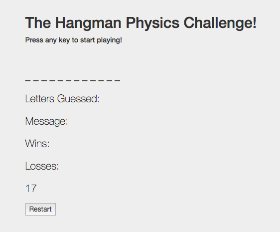
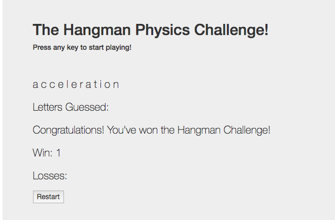

## JS Hangman Game

## Process

1. Create a new GitHub repo called `Hangman-Game`, in accordance with the assignment you choose to complete. Then, clone it to your computer.

2. Inside your local git repository, create an `index.html`.

3. While still in your local git repo, create a directory called `assets`.
4. `cd` your way into the `assets` folder, then make three additional folders: `javascript`, `css` and `images`.

   * In the `javascript` folder, make a file called `game.js`. Use the `src` attribute of the `script` tag to link to this file, rather than embedding the code directly in your HTML document.
   * In the `css` folder, make a file called `style.css`.
   * Also in the `css` folder, make a file called `reset.css`. Paste into it the code from the Meyerweb reset stylesheet. If you opt to use Bootstrap instead of writing your own CSS, skip this step, and simply include a link to Bootstrap via CDN.
   * In the `images` folder, save whatever images you plan on using.

5. Push the above changes to GitHub.

6. Choose whichever game you'd like to build. Making the Psychic game will prove less challenging than coding Hangman. However, as the challenge of the Hangman exercise provides a more comprehensive review of this week's material, we suggest attempting that assignment first.

7. Note: There's no shame if you'd prefer submitting Psychic—it's still a proper challenge.

8. Push your selected game to Github Pages.

##### Copyright
##### Coding Boot Camp © 2016. All Rights Reserved.
